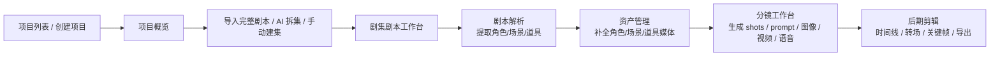
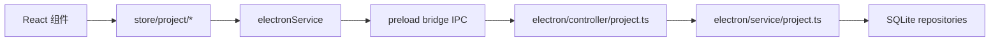

# Koma 非灵绘工作流程整理

本文只整理 Koma 当前主项目流，不包含灵绘工作台。

## 1. 范围

非灵绘主流程覆盖以下模块：

- 项目列表与项目创建
- 项目概览与剧集管理
- 剧本编辑、AI 生成、AI 解析
- 角色 / 场景 / 道具资产生产
- 分镜生成、分镜提示词、图像 / 视频 / 音频生成
- 后期时间线编辑与导出
- Electron 后端项目持久化与媒体绑定

不包含：

- `frontend/src/components/linghui/**`
- `electron/service/linghui/**`

## 2. 总体流程

## 3. 页面层工作流

### 3.1 项目入口

入口在 `App`，主视图分成：

- `projects`: 项目列表
- `overview`: 项目概览
- `editor`: 制作流程
- `settings` / `plugins` / `chat`

关键入口文件：

- `frontend/src/App.tsx`
- `frontend/src/hooks/useProjects.ts`

主要行为：

- 启动时通过 `useProjects()` 调 `electronService.project.list()` 加载项目列表
- 创建项目时生成项目元信息、风格快照、默认比例等，再通过 IPC 交给 Electron 后端创建
- 选择项目后进入 `ProjectOverview`

### 3.2 项目概览

`ProjectOverview` 是非灵绘流程的总控页面，负责把“项目”推进到“剧集”和“制作步骤”。

关键文件：

- `frontend/src/components/project/ProjectOverview.tsx`
- `frontend/src/components/project/EpisodeManager.tsx`
- `frontend/src/components/project/EpisodeSplitWizard.tsx`
- `frontend/src/components/project/ProjectAssetOverview.tsx`
- `frontend/src/components/project/ScriptWorkbench.tsx`

在这里用户会做几件事：

- 配置项目级模型选择：`llm` / `tti` / `itv` / `tts`
- 导入完整剧本
- 使用 AI 自动拆集，或手动创建剧集
- 查看项目级资产总览和跨集引用情况
- 选择某一集进入正式制作

### 3.3 剧集剧本工作台

剧本工作台围绕单集 `Episode` 运作。

核心能力：

- 编辑剧本文本
- 2 秒防抖自动保存
- 手动保存
- AI 随机生成剧本
- AI 润色
- 启动后台剧本解析

关键文件：

- `frontend/src/components/project/ScriptWorkbench.tsx`
- `frontend/src/editor/ScriptEditor.tsx`
- `frontend/src/services/ScriptAnalysisService.ts`

当前行为特征：

- 剧本正文保存在 `episodes.script_text`
- 剧本解析结果单独保存在剧集分析数据中
- 剧本解析是后台任务，不阻塞页面继续编辑

### 3.4 正式制作三步

进入 `EditorView` 后，流程被明确分成三步：

1. `assets`
2. `storyboard`
3. `video`

关键文件：

- `frontend/src/components/editor/EditorView.tsx`

对应关系：

- `assets` 对应资产管理
- `storyboard` 对应分镜工作台
- `video` 对应后期时间线编辑器

## 4. 资产阶段

### 4.1 输入

资产阶段的输入来自两部分：

- 项目级实体库：角色、场景、道具
- 当前剧集的解析结果：该集实际引用了哪些角色、场景、道具

关键文件：

- `frontend/src/components/asset/AssetManagerPanel.tsx`
- `frontend/src/store/project/entities.ts`
- `frontend/src/store/project/analysis.ts`

### 4.2 核心行为

资产管理页负责：

- 加载项目的角色 / 场景 / 道具
- 根据当前剧集分析结果筛选“本集资产”
- 手动创建、编辑、删除资产
- 触发 AI 生成角色形象、场景图、道具图、角色预览视频等
- 在点击下一步时，如果当前剧集还没有分镜，则自动启动分镜分析

### 4.3 数据结果

资产阶段会沉淀三类结果：

- 实体基础信息：名称、描述、提示词、引用关系
- 实体媒体信息：本地路径、远程 URL、provider 元数据
- 剧集级引用关系：某角色 / 场景 / 道具出现在哪些剧集

## 5. 分镜阶段

### 5.1 分镜生成

分镜阶段围绕 `Shot[]` 工作。

关键文件：

- `frontend/src/components/storyboard/Storyboard.tsx`
- `frontend/src/services/ShotAnalysisService.ts`
- `frontend/src/services/ShotPromptService.ts`
- `frontend/src/workflow/shotRenderWorkflow.ts`
- `frontend/src/workflow/shotVideoPlan.ts`

`ShotAnalysisService` 会根据：

- 当前集剧本
- 当前项目角色 / 场景 / 道具
- 当前项目风格快照

让 LLM 生成结构化分镜列表，落成 `Shot[]`。

每个 shot 主要包含：

- `scriptContent`
- `shotType`
- `cameraMovement`
- `duration`
- `characters`
- `scenes`
- `props`
- `dialogue`
- `emotion`

### 5.2 分镜编辑

Storyboard 页面支持：

- 分镜列表编辑
- 分镜脚本片段编辑
- @mention 角色 / 场景 / 道具
- 生成图片 prompt / 视频 prompt
- 单镜头或批量生成图片
- 单镜头或批量生成视频
- 管理参考图、版本图、版本视频、版本音频

这里的核心原则是：

- 资产绑定统一使用项目内实体 ID
- prompt 编译时再根据 provider 能力映射成真实请求
- 图像、视频、语音都会绑定回具体 `shot` 或 `shot-version`

### 5.3 分镜媒体生成

媒体生成由 `MediaGenerationService` 统一调度。

关键职责：

- 根据项目选择的模型解析出 provider
- 根据能力选择生成类型：文生图、图生图、图生视频、参考生视频、语音
- 解析引用资产并转成 provider 可接受的输入
- 持久化生成结果
- 将结果绑定回 `ownerRef`

`shotRenderWorkflow` 里的典型链路是：

1. 收集当前 shot 的角色、场景、道具、主图、参考图
2. 推断该次视频生成需要的 capability
3. 编译出 provider request
4. 如有台词，先生成 TTS
5. 再生成视频
6. 持久化媒体资产
7. 把视频 / 音频写回 shot version

### 5.4 分镜阶段输出

这一阶段最终输出：

- 剧集级 `shots`
- shot 的图像 / 视频 / 音频版本
- prompt、seed、模型信息
- 供后期编辑使用的镜头媒体

## 6. 后期剪辑阶段

后期阶段由 `SimpleEditor` 承接。

关键文件：

- `frontend/src/components/editor/SimpleEditor.tsx`
- `frontend/src/components/editor/SimpleTimeline.tsx`
- `frontend/src/components/editor/SimplePlayer.tsx`
- `frontend/src/features/transition/core/**`

### 6.1 输入

后期阶段的输入默认来自分镜：

- 如果有已保存时间线，则优先加载时间线
- 如果没有已保存时间线，则根据 `shots` 自动生成初始 tracks

自动生成规则：

- shot 当前视频优先作为视频 clip
- 如果没有视频则退回当前图片
- shot 台词会生成 text clip

### 6.2 编辑能力

后期编辑器支持：

- 多轨道时间线
- clip 拖拽排布
- 文本、图片、视频、音频素材混编
- 转场
- 关键帧
- 属性面板
- 上传外部素材
- 导出

### 6.3 保存方式

后期时间线会自动保存到剧集级 timeline。

保存前会做两件事：

- 迁移 / 规范化 timeline 数据结构
- 将 clip 的媒体地址优先 remap 到本地路径

## 7. 前后端数据流

### 7.1 前端分层

前端当前采用“薄 UI + store/service 调度”的结构：

- 组件层负责页面与交互
- `store/project/*` 负责项目域 API 封装
- `services/*` 负责 AI、任务、媒体、工作流
- `electronService` 负责 IPC 桥接

主链路如下：

### 7.2 Electron 后端

非灵绘项目域的后端入口：

- `electron/controller/project.ts`
- `electron/service/project.ts`
- `electron/service/storage/**`

后端职责：

- 项目 / 剧集 / 角色 / 场景 / 道具 / 分镜 / 时间线 CRUD
- 统一持久化到 SQLite
- 媒体资产与业务对象绑定
- 项目导入 / 导出
- 项目级完整加载

### 7.3 SQLite 当前承载的数据

当前 SQLite 已承载主项目的大部分结构化业务数据，包括：

- `projects`
- `episodes`
- `characters`
- `scenes`
- `props`
- `shots`
- `shot_versions`
- `assets`
- `timelines`
- `timeline_tracks`
- `timeline_clips`
- 以及 shot / entity 的关系表

关键文件：

- `electron/service/storage/schema.ts`

### 7.4 文件系统仍承载的内容

当前仍使用文件存储的主要是媒体与缓存：

- 图片
- 视频
- 音频
- 缩略图 / 波形 / 预览帧
- 导出产物
- 临时文件

也就是说，当前项目域已经基本形成：

- 结构化业务数据进 SQLite
- 大媒体文件继续走文件系统

## 8. 任务与异步执行

当前非灵绘流程存在两套任务系统：

### 8.1 `TaskManager`

用于分析类和页面级后台任务：

- 剧本解析
- 分镜分析
- 资产生成类后台状态同步

特点：

- 项目级初始化
- 支持 listener
- 支持 stale task 恢复
- 任务持久化到 `background-tasks.json`

关键文件：

- `frontend/src/services/TaskManager.ts`

### 8.2 `taskQueueStore`

用于媒体生成任务：

- TTI
- ITV
- TTS

特点：

- 以 `tasks.json` 记录远程媒体任务
- `MediaGenerationService` 负责创建 / 更新 / 完成 / 失败
- 生成完成后再回写到业务对象

关键文件：

- `frontend/src/store/taskQueueStore.ts`
- `frontend/src/services/MediaGenerationService.ts`

### 8.3 页面如何感知任务

典型方式有两类：

- 页面通过 `TaskManager.addListener()` 监听分析任务完成
- 页面通过任务状态栏 `TaskStatusBar` 展示当前项目任务进度

## 9. 当前非灵绘流程的主线总结

如果只看“一个项目从 0 到 1”的最短路径，当前主线是：

1. 创建项目并设置风格、模型选择
2. 导入完整剧本
3. AI 拆分剧集
4. 在单集剧本工作台继续编辑、润色、保存
5. 对单集执行剧本解析，得到角色 / 场景 / 道具引用
6. 在资产页补齐角色、场景、道具及对应媒体
7. 自动或手动生成分镜
8. 在分镜页继续编写 prompt，并生成图片 / 视频 / 语音
9. 进入后期时间线编辑，微调剪辑、转场和关键帧
10. 导出成片或继续迭代

## 10. 对后续规范化有帮助的切分方式

如果后续要继续做“前端更薄、后端更重”的整理，非灵绘流程可以天然拆成 5 个后端能力边界：

1. 项目域：项目、剧集、设置、导入导出
2. 实体域：角色、场景、道具、跨集引用
3. 分镜域：shots、shot versions、prompt、引用资产
4. 媒体域：资产落盘、远程任务、媒体绑定
5. 时间线域：timeline、track、clip、transition、keyframe

这样拆完后，前端更适合只保留：

- 页面状态
- 表单编辑状态
- 视图层组合
- 少量乐观更新

而把真正的数据约束、关系维护、回写逻辑尽量收口到 Electron 后端。
