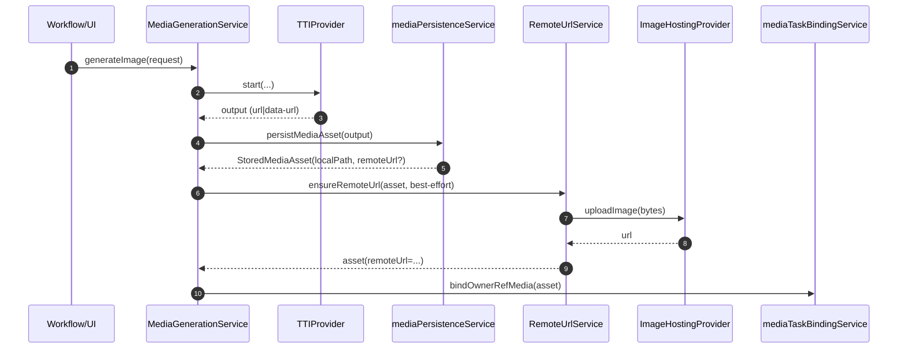
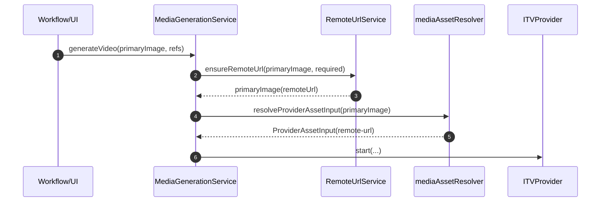

# Design: Pluggable Image Hosting + RemoteUrl Normalization

## Goals
1. 文生图、参考图生图、图生视频的“图片输入”统一走 `StoredMediaAsset{localPath, remoteUrl}`。
2. 当输出/输入缺少 `remoteUrl` 时，提供一个 **单点收口** 的转换能力：落盘后上传图床得到 URL。
3. 图床服务 **可热插拔**：通过 `channelConfig + ProviderRegistry(kind='image-hosting')` 动态切换。
4. 不在 workflow 中散落兼容代码；不把“上传副作用”塞进 resolver。

## Architecture

### Key Types
- `StoredMediaAsset`：项目内统一资产结构（已存在）。
- `ProviderAssetInput`：provider 边界的输入（`remote-url` 或 `data-url`）。
- 新增 `ImageHostingProvider`：图床 provider 合同。

### Components
1. `RemoteUrlService`（新增，核心收口点）
   - 输入：`StoredMediaAsset | string`（localPath/data-url/blob/remote）
   - 输出：`StoredMediaAsset`（补齐 `remoteUrl`）或 `ProviderAssetInput`（用于 provider start）
   - 依赖：`image-hosting` provider（从 channelConfig 选默认）

2. `imageHostingService`（重构为 orchestrator）
   - 只负责：选择默认图床渠道、创建 provider 实例、调用 upload。
   - 不再硬编码 SCDN API 协议，不再自己扫描 channelConfigs 的 providerType。

3. `MediaGenerationService`（接入点）
   - 输入侧：ITV/TTI references 在进入 resolver 前可选进行 remoteUrl 规范化。
   - 输出侧：TTI 生成图片落盘后补齐 remoteUrl（可配置 best-effort）。

## Provider Contract (image-hosting)

### Interface (TypeScript)
```ts
export interface ImageHostingUploadOptions {
  filename?: string;
  outputFormat?: string;
  cdnDomain?: string;
}

export interface ImageHostingUploadResult {
  success: boolean;
  url?: string;
  error?: string;
  metadata?: Record<string, unknown>;
}

export interface ImageHostingProvider {
  type: string;
  validate(): boolean;
  testConnection(): Promise<boolean>;
  uploadImage(bytes: ArrayBuffer | Uint8Array, options?: ImageHostingUploadOptions): Promise<ImageHostingUploadResult>;
}
```

### Why bytes-in contract
将“source 是 localPath/data-url/blob-url/remote-url”的兼容处理集中在 `RemoteUrlService`，provider 只做一件事：把 bytes 上传并返回 URL。这样“参数传递收口”更稳定，调用方不需要知道图床协议差异。

## Normalization Policy
为避免在多个入口散落条件分支，采用“策略参数”集中在 `RemoteUrlService`：

- `best-effort`：尽力补齐 remoteUrl；失败则返回原 asset（localPath 仍可用）。
- `required`：如果无法得到 remoteUrl，则抛错，并提示用户启用图床/检查配置。

建议默认：
- TTI 输出补齐 remoteUrl：`best-effort`（不阻断生成落盘）。
- ITV primaryImage：`required`（如果目标 ITV provider 是远程且不接受 data-url）。

最终策略取决于 Open Questions 的确认结果。

## Sequence Diagrams

### TTI output normalization


### ITV input normalization


