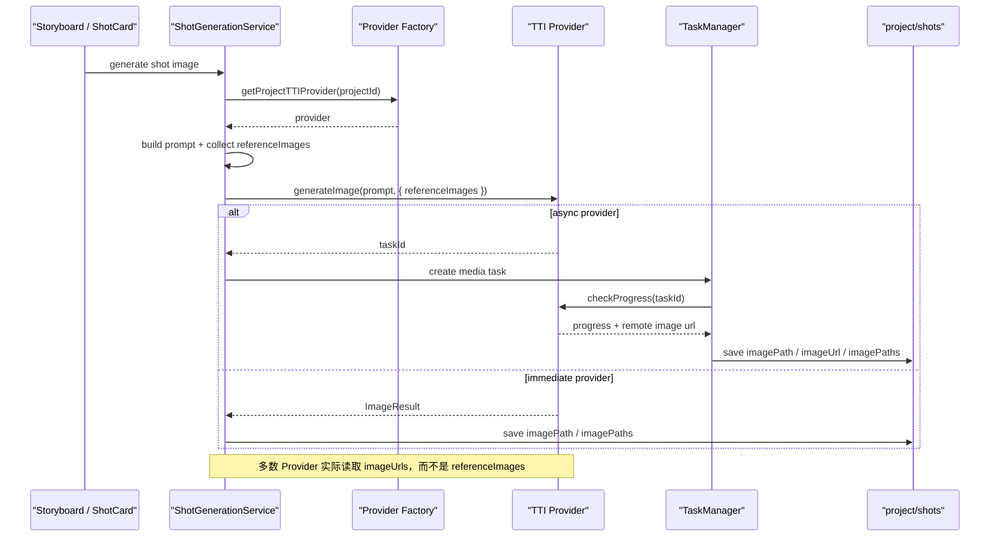
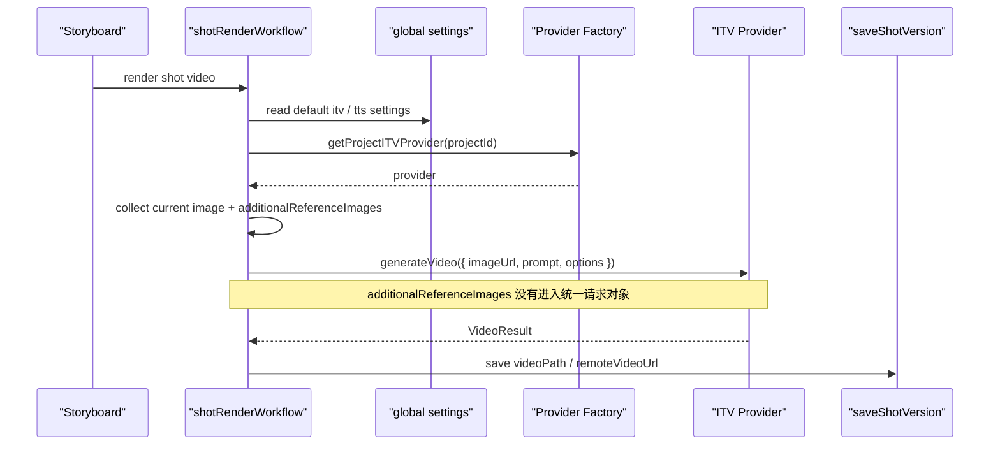
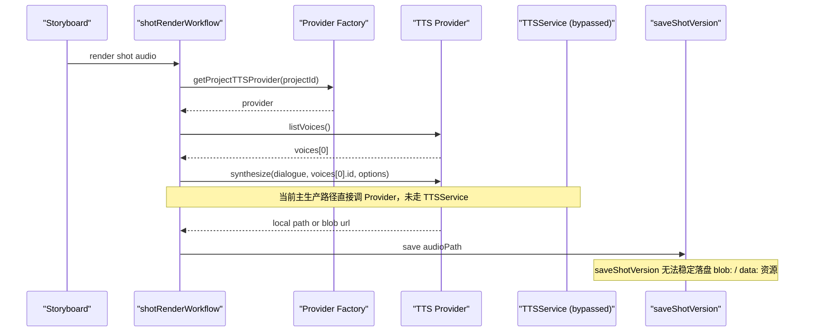
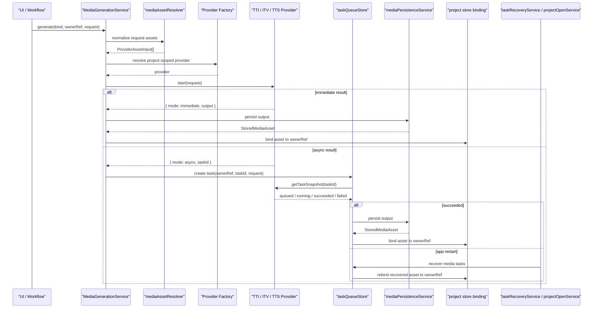

## Context
当前媒体生成链路已经从“功能可用”进入“结构失配”阶段，核心断点集中在四个方面：

1. 任务系统分裂
   - 分镜生图主要走 `frontend/src/services/TaskManager.ts`
   - 角色 / 场景 / 道具生成、预览视频等主要走 `frontend/src/store/taskQueueStore.ts`
   - 结果是任务创建、轮询、恢复、回写的语义不一致
2. Provider 契约不一致
   - TTI 返回 `ImageResult | taskId`
   - ITV 对外直接返回最终 `VideoResult`，Provider 内部自己轮询
   - TTS 直接返回 `AudioResult`，不同 Provider 还会混用本地路径、远程地址、`blob:` URL
3. 项目存储模型平行字段过多
   - `imagePath`, `imageUrl`, `previewVideoPath`, `previewVideoTaskId`, `remoteVideoUrl` 等字段散落在 Character / Scene / Prop / Shot / ShotVersion
   - UI、工作流、存储层都需要反复判断“到底哪个字段才是真值”
4. 数据链路跨层泄漏
   - `blob:` / `data:` / 远程 URL / 本地路径直接穿透到工作流和 Store
   - 项目级 Provider 配置没有在所有入口统一生效
   - 恢复流程只恢复任务状态，没有稳定回写到业务实体

## Current-State Sequence Diagrams

### 1. 生图链路


### 2. 生视频链路


### 3. 生语音链路


### 4. 目标统一链路


## Goals / Non-Goals

**Goals**
- 把 TTI / ITV / TTS 的参数传递收口为统一 request 契约
- 把媒体输出收口为统一的结构化资产对象
- 把媒体任务收口到单一任务队列与恢复流程
- 把媒体持久化收口到单一服务边界
- 把项目级 Provider 配置解析收口到统一工厂入口
- 把兼容逻辑限制在“项目迁移层 + 插件 SDK 版本边界”

**Non-Goals**
- 不重写提示词生成算法本身
- 不在本提案中重做 UI 视觉层
- 不为旧插件长期保留运行时兼容分支
- 不改变现有项目目录结构的主干，只调整媒体元数据表达

## Decisions

### 1. 统一媒体输入、输出与任务契约
所有媒体 Provider 都改为 request-based 输入和统一的 start / task-snapshot 生命周期。

```ts
type MediaKind = 'image' | 'video' | 'audio';

interface ProviderAssetInput {
  transport: 'remote-url' | 'data-url';
  value: string;
  mimeType?: string;
}

interface StoredMediaAsset {
  kind: MediaKind;
  localPath: string;
  remoteUrl?: string;
  mimeType?: string;
  width?: number;
  height?: number;
  durationMs?: number;
  fps?: number;
  provider?: string;
  providerTaskId?: string;
  createdAt: number;
}

type ProviderStartResult<T> =
  | { mode: 'immediate'; output: T }
  | { mode: 'async'; taskId: string };

interface ProviderTaskSnapshot<T> {
  state: 'queued' | 'running' | 'succeeded' | 'failed';
  progress?: number;
  output?: T;
  error?: string;
}

interface TTIRequest {
  prompt: string;
  references?: ProviderAssetInput[];
  options?: Record<string, unknown>;
}

interface ITVRequest {
  prompt: string;
  primaryImage: ProviderAssetInput;
  additionalReferences?: ProviderAssetInput[];
  options?: Record<string, unknown>;
}

interface TTSRequest {
  text: string;
  voiceId: string;
  options?: Record<string, unknown>;
}
```

这样做的目的不是“把所有 Provider 做成同一个实现”，而是保证工作流层永远只面对同一套语义。

### 2. 统一媒体持久化边界
新增两层边界服务：

- `mediaAssetResolver`
  - 输入：本地文件路径、项目内已有资产、`blob:`、`data:`、远程 URL
  - 输出：`ProviderAssetInput`
  - 责任：把“媒体如何传给 Provider”从工作流和 UI 中抽掉
- `mediaPersistenceService`
  - 输入：Provider 原始输出
  - 输出：`StoredMediaAsset`
  - 责任：把“媒体如何落盘并写回项目”从工作流和 Store 中抽掉

这样可以去掉当前 `saveShotVersion` 和多个 workflow 里的协议分支判断。

### 3. 媒体任务统一归口到 `taskQueueStore`
媒体任务不再由 `TaskManager` 和 `taskQueueStore` 并存管理。

- `taskQueueStore` 成为唯一的媒体任务状态源
- `TaskManager` 仅保留非媒体类分析任务，或被降级为 taskQueue 的薄封装
- 每个媒体任务必须保存 `ownerRef`，用于恢复后的自动回写

建议任务归属结构如下：

```ts
interface MediaOwnerRef {
  projectId: string;
  ownerType: 'character' | 'scene' | 'prop' | 'shot' | 'shot-version';
  ownerId: string;
  slot:
    | 'costumePhoto'
    | 'previewImage'
    | 'previewVideo'
    | 'referenceImage'
    | 'image'
    | 'video'
    | 'audio';
  episodeId?: string;
  versionId?: string;
}
```

### 4. 项目级 Provider 解析必须统一
所有媒体入口都使用同一条规则：

1. 先读取项目保存的 `ttiConfigId` / `itvConfigId` / `ttsConfigId`
2. 项目未配置时才回退全局默认
3. UI 组件不再各自读取 `settings` 并自行拼装默认配置

这条规则必须同时覆盖：

- 角色定妆照生成
- 场景图 / 道具图生成
- 角色 / 道具预览视频生成
- 分镜图片生成
- 分镜视频渲染
- 分镜语音生成

### 5. 项目媒体字段统一为结构化媒体槽位
建议把当前平行字段收敛为如下表达：

| 业务对象 | 当前散落字段 | 目标槽位 |
| --- | --- | --- |
| Character | `costumePhotoPath`, `costumePhotoUrl`, `previewVideoPath`, `previewVideoTaskId` | `media.costumePhoto`, `media.previewVideo` |
| Scene | `imagePath`, `imageUrl` | `media.previewImage` |
| Prop | `imagePath`, `imageUrl`, `previewVideoPath`, `previewVideoTaskId` | `media.previewImage`, `media.previewVideo` |
| Shot | `referenceImages`, `imagePath`, `imageUrl`, `imagePaths`, `videos` | `referenceMedia[]`, `images[]`, `videos[]` |
| ShotVersion | `imagePath`, `videoPath`, `audioPath`, `remoteImageUrl`, `remoteVideoUrl` | `image`, `video`, `audio` |

关键原则：

- 新代码不再读写旧字段
- 旧字段只在迁移函数里读取一次
- 项目成功迁移后，后续持久化只写新结构

### 6. 插件 SDK 采用版本边界，而不是运行时兼容矩阵
插件侧同样要切到统一 request / task-snapshot 契约。

- `plugin-sdk` 明确标记新的媒体 Provider SDK 版本
- 不兼容版本的插件在注册阶段直接失败并给出提示
- 不在宿主工作流层保留“旧插件字段名兼容”逻辑

这符合“参数传递收口、兼容逻辑只保留一个边界”的目标。

## Data Chain Repair Matrix

| 数据链路 | 当前断点 | 修复边界 |
| --- | --- | --- |
| Shot 生图参考图 | `referenceImages` 传出去了，但 Provider 常只认 `imageUrls` | `ShotGenerationService` 只组装语义化 `TTIRequest.references`，由 `mediaAssetResolver` 统一喂给 Provider |
| Shot 生视频附加参考图 | `additionalReferenceImages` 收集了但未传给 ITV Provider | `shotRenderWorkflow` 改为构建 `ITVRequest.primaryImage + additionalReferences` |
| TTS 输出持久化 | `blob:` / 本地路径 / 远程 URL 混用 | `mediaPersistenceService` 统一落盘并返回 `StoredMediaAsset` |
| 任务恢复 | 恢复了任务，但没有回写实体或分镜 | `taskQueueStore + taskRecoveryService + projectOpenService` 通过 `ownerRef` 完成回写 |
| 项目级配置 | 渲染入口可能走默认设置，绕过项目配置 | `providers/index.ts` 暴露单一项目级工厂入口，UI 不再自行读设置 |
| 预览视频任务 ID | `previewVideoTaskId` 平行字段泄漏到业务对象 | `providerTaskId` 进入结构化 `StoredMediaAsset` 元数据 |

## Risks / Trade-offs

1. 数据模型调整面广
   - Mitigation: 先做一次性迁移，再禁止新代码继续写旧字段
2. Provider 改造需要同步插件 SDK
   - Mitigation: 用 SDK 版本边界快速失败，避免宿主代码出现长期兼容分支
3. 任务恢复逻辑变复杂
   - Mitigation: 强制所有媒体任务携带 `ownerRef`，恢复只走统一绑定路径
4. 存量项目可能存在 `blob:` 或无法访问的历史 URL
   - Mitigation: 迁移时尽量物化为本地资产；无法物化的条目标记为需要重新生成

## Migration Plan

1. 新增统一类型与边界服务，但暂不删旧字段
2. 实现项目打开时的媒体字段迁移，将旧字段物化到结构化媒体对象
3. 改造所有内置 Provider 和工作流到统一 request / task-snapshot 契约
4. 切换 UI 和 Store 读取路径到新结构
5. 删除工作流、UI、Store 中残留的旧字段兼容读写
6. 更新插件 SDK，并要求插件按新版本重新编译

回滚策略：

- 项目迁移前先备份原始项目 JSON
- 在提案落地期间禁止混合写入新旧两套字段
- 若迁移失败，可回退到备份项目数据重新打开

## Open Questions

- `Shot` 是否保留“当前选中索引”还是改为“当前选中资产 ID”，实现阶段需要结合现有 UI 状态模型最终确定
- `StoredMediaAsset` 是否需要引入稳定 `id` 字段，取决于分镜版本切换和媒体面板是否需要跨集合引用
